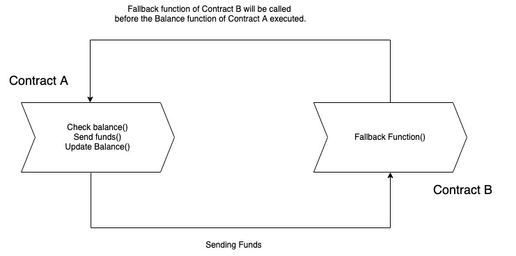
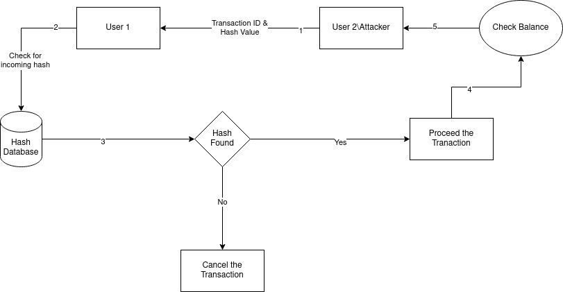

Function Locking Technique for Preventing Reentrancy Attack in Smart Contract

Reentrancy attacks have been a significant threat to smart contracts on blockchain platforms. This attack allows an attacker to call a vulnerable function in a contract repeatedly, leading to unexpected behavior and loss of funds. In this research paper, we propose a preventive approach to mitigate the reentrancy attack by introducing a locking mechanism. Our proposed method involves the use of a lock that prevents a contract from being called again until the previous execution is completed. We implement and evaluate our proposed approach on the Ethereum blockchain platform using various benchmarks. Our results show that our approach effectively prevents reentrancy attacks while incurring a low overhead cost. Our proposed approach can be integrated into smart contract development to enhance security and protect against reentrancy attacks by implementing the Function locking technique and Verifying by hashing technique.

Methodology:

Here the User1 is a victim, and User2 is the attacker. Now the attacker is trying to steel the extra etherum from the User1, This is the reentrancy attack.
My approch to prevent this, implementing the Function Locking and Hash comparision. When the User2 requested the etherum, along with the request User2 will send the hash value of the withdrawal function, User1 will compare that hash value with the hash value which is in the server database. That Hash Value in server database has the ligitimate withdrawal functions hash value. If hash value is match, then the process will be proceed, if not the transaction will be cancelled.

Now if the transaction is proceed, for every 1 transaction the User1 will check its balance, here the getBalance() function is interlocked inside the withdrawal function. so if balance is over the transaction will be closed.

Run the code:
1. Copy the code and paste in "remix.ethereum.org/" in two different file, name Attack.sol and DepositFunds.sol.
2. Install hardhat in ur local machine, 
    i. install npm, download node.js and install it.
    ii. npm install --save-dev hardhat
3. Run 'npx hardhat node'.
4. Select hardhat in remix.
5. Compile Depostfud.sol and Attack.sol.
